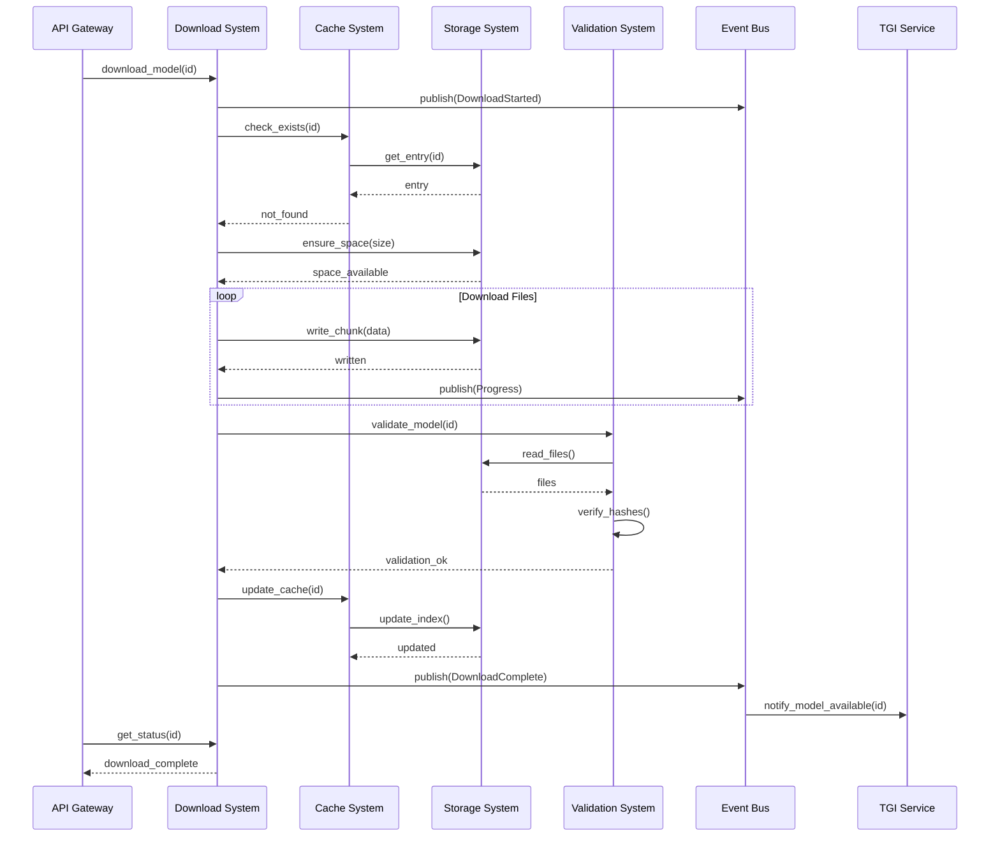
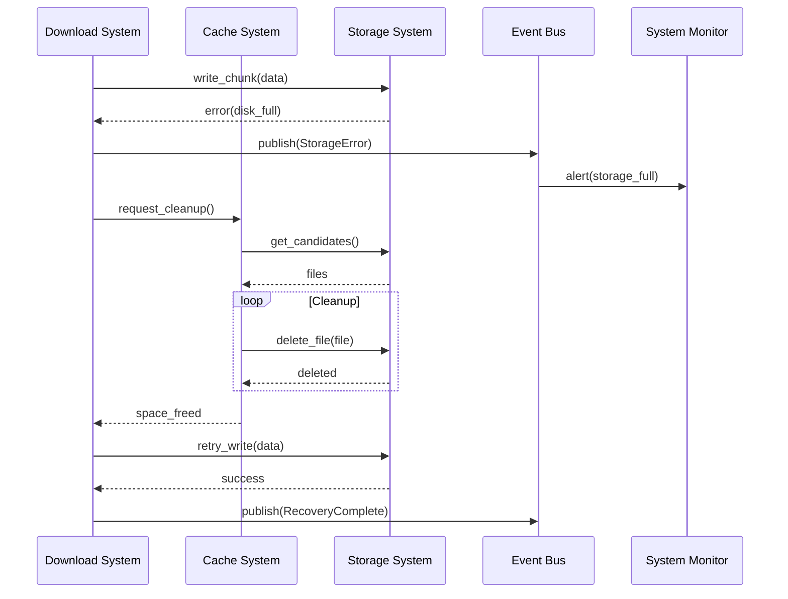
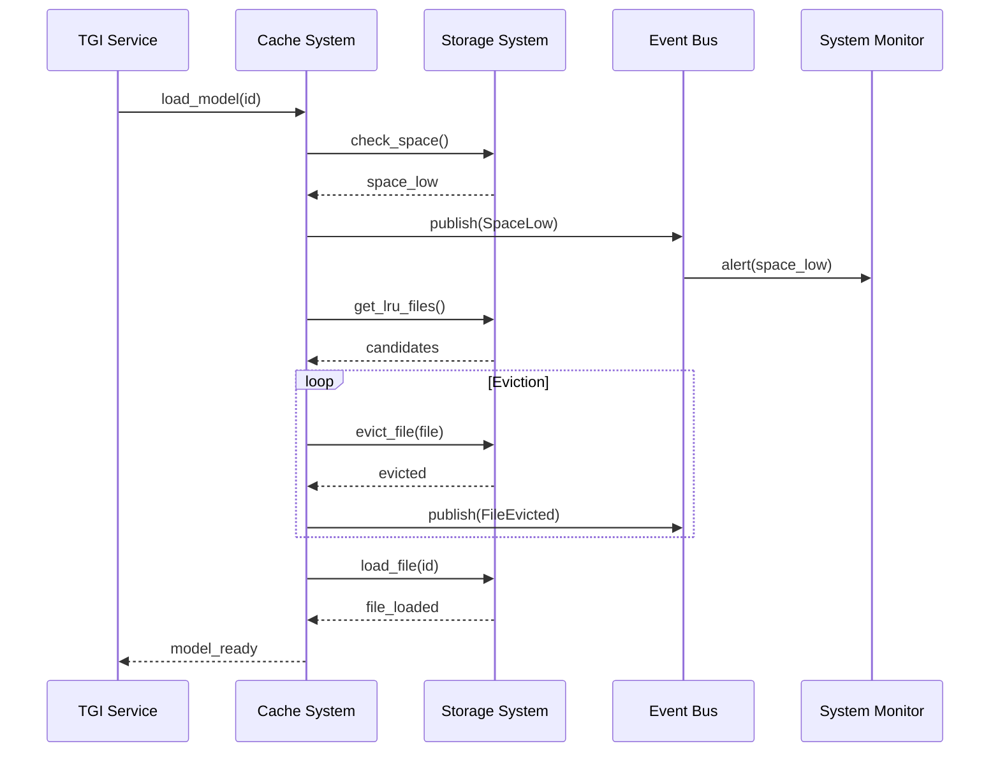
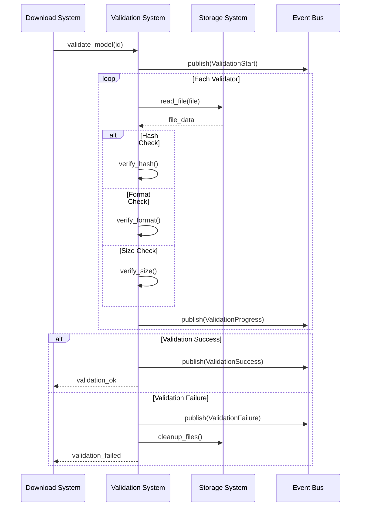

# Cross-Component Interactions

## Model Download Complete Flow

```mermaid
sequenceDiagram
    participant API as API Gateway
    participant DL as Download System
    participant Cache as Cache System
    participant Store as Storage System
    participant Val as Validation System
    participant Events as Event Bus
    participant TGI as TGI Service

    API->>DL: download_model(id)
    DL->>Events: publish(DownloadStarted)

    DL->>Cache: check_exists(id)
    Cache->>Store: get_entry(id)
    Store-->>Cache: entry
    Cache-->>DL: not_found

    DL->>Store: ensure_space(size)
    Store-->>DL: space_available

    loop Download Files
        DL->>Store: write_chunk(data)
        Store-->>DL: written
        DL->>Events: publish(Progress)
    end

    DL->>Val: validate_model(id)
    Val->>Store: read_files()
    Store-->>Val: files
    Val->>Val: verify_hashes()
    Val-->>DL: validation_ok

    DL->>Cache: update_cache(id)
    Cache->>Store: update_index()
    Store-->>Cache: updated

    DL->>Events: publish(DownloadComplete)
    Events->>TGI: notify_model_available(id)

    API->>DL: get_status(id)
    DL-->>API: download_complete
```

## Error Recovery Flow

```mermaid
sequenceDiagram
    participant DL as Download System
    participant Cache as Cache System
    participant Store as Storage System
    participant Events as Event Bus
    participant Monitor as System Monitor

    DL->>Store: write_chunk(data)
    Store-->>DL: error(disk_full)

    DL->>Events: publish(StorageError)
    Events->>Monitor: alert(storage_full)

    DL->>Cache: request_cleanup()
    Cache->>Store: get_candidates()
    Store-->>Cache: files

    loop Cleanup
        Cache->>Store: delete_file(file)
        Store-->>Cache: deleted
    end

    Cache-->>DL: space_freed
    DL->>Store: retry_write(data)
    Store-->>DL: success

    DL->>Events: publish(RecoveryComplete)
```

## Cache Management Flow

```mermaid
sequenceDiagram
    participant TGI as TGI Service
    participant Cache as Cache System
    participant Store as Storage System
    participant Events as Event Bus
    participant Monitor as System Monitor

    TGI->>Cache: load_model(id)
    Cache->>Store: check_space()
    Store-->>Cache: space_low

    Cache->>Events: publish(SpaceLow)
    Events->>Monitor: alert(space_low)

    Cache->>Store: get_lru_files()
    Store-->>Cache: candidates

    loop Eviction
        Cache->>Store: evict_file(file)
        Store-->>Cache: evicted
        Cache->>Events: publish(FileEvicted)
    end

    Cache->>Store: load_file(id)
    Store-->>Cache: file_loaded
    Cache-->>TGI: model_ready
```

## Validation Chain Flow

```mermaid
sequenceDiagram
    participant DL as Download System
    participant Val as Validation System
    participant Store as Storage System
    participant Events as Event Bus

    DL->>Val: validate_model(id)
    Val->>Events: publish(ValidationStart)

    loop Each Validator
        Val->>Store: read_file(file)
        Store-->>Val: file_data

        alt Hash Check
            Val->>Val: verify_hash()
        else Format Check
            Val->>Val: verify_format()
        else Size Check
            Val->>Val: verify_size()
        end

        Val->>Events: publish(ValidationProgress)
    end

    alt Validation Success
        Val->>Events: publish(ValidationSuccess)
        Val-->>DL: validation_ok
    else Validation Failure
        Val->>Events: publish(ValidationFailure)
        Val->>Store: cleanup_files()
        Val-->>DL: validation_failed
    end
```
