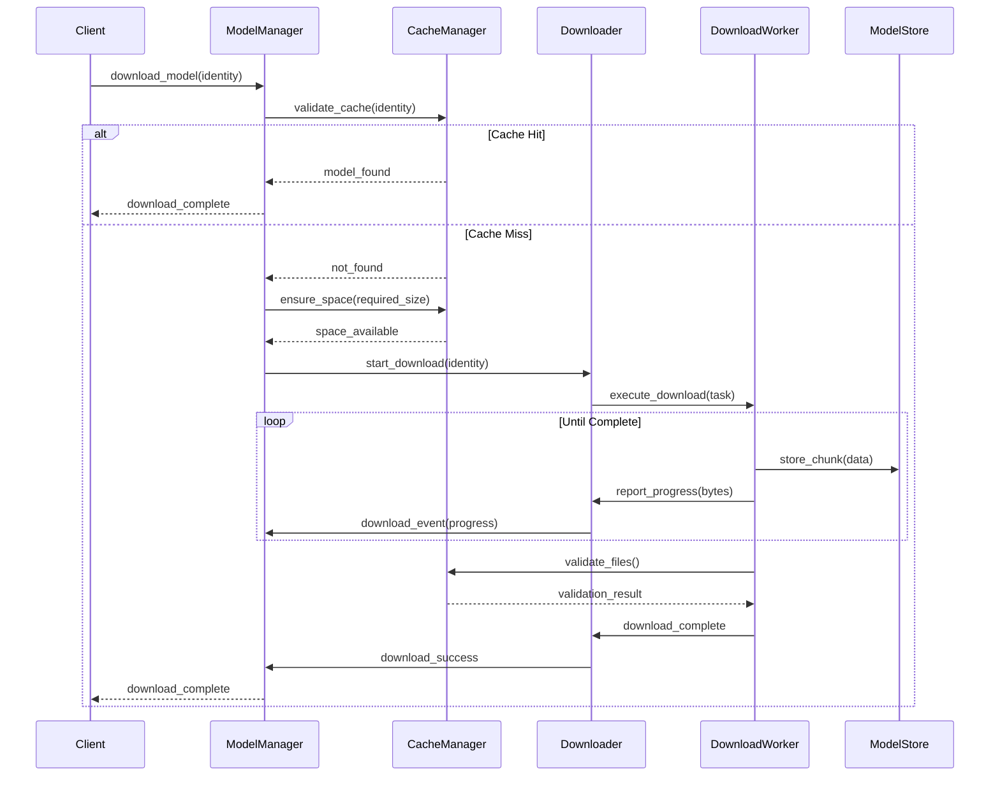
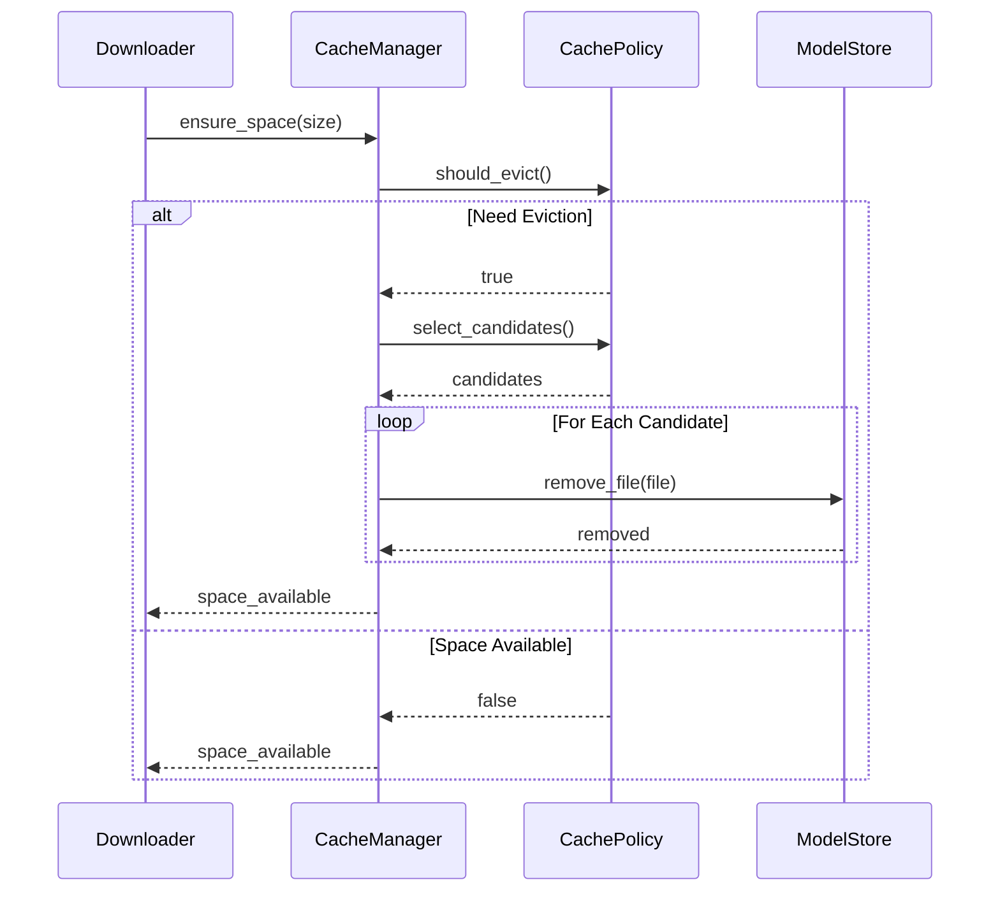
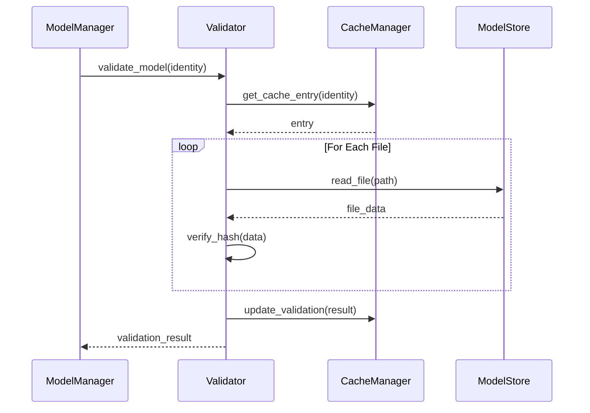

# Model Manager Sequence Diagrams

## Model Download Flow

## Cache Management Flow

## Model Validation Flow

These sequence diagrams show:
1. Complete download workflow
2. Cache management decisions
3. Model validation process
4. Error handling points
5. Event propagation
