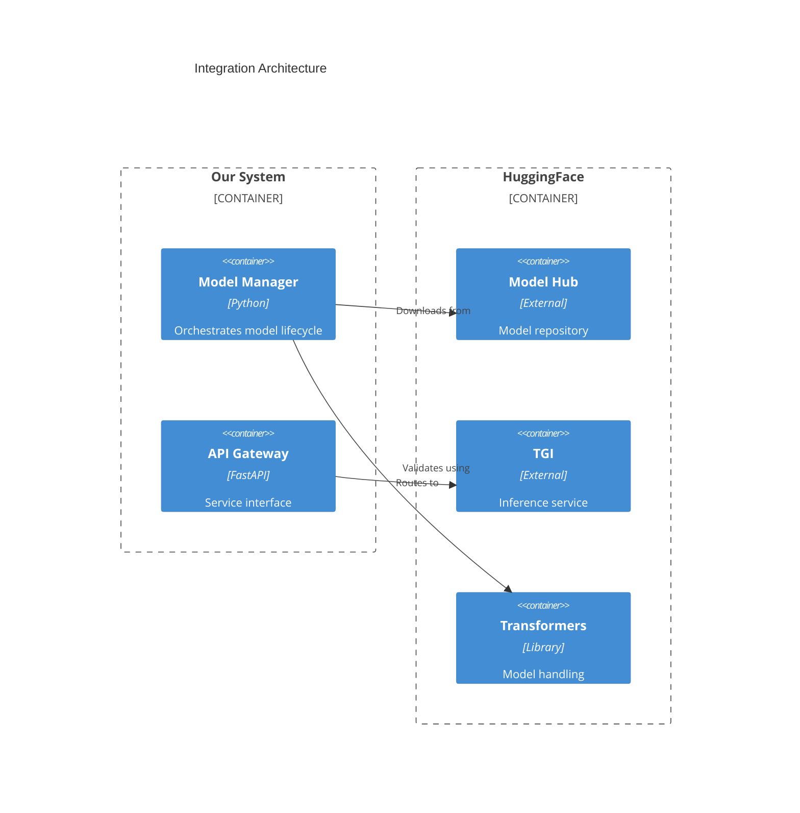
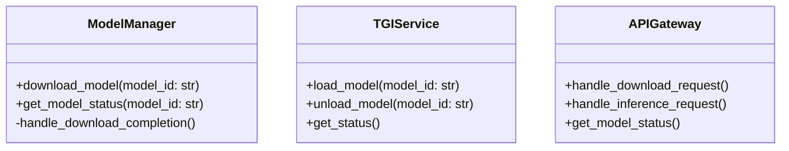

# HuggingFace Integration Design

## 1. Core HuggingFace Components We Use

1. **Model Hub**

   - Repository access
   - Model files download
   - File validation
   - Versioning

2. **Transformers Library**

   - Model loading
   - File format handling
   - Model validation

3. **TGI (Text Generation Inference)**
   - Model serving
   - Request handling
   - Resource management

## 2. Our Integration Points



## 3. What We Don't Need to Implement

1. **Download System**

   - ✅ Use `huggingface_hub.snapshot_download()`
   - ✅ Built-in caching
   - ✅ Automatic validation
   - ✅ Resume capability

2. **Validation**

   - ✅ Use `transformers.AutoModel.from_pretrained()`
   - ✅ Built-in format validation
   - ✅ Hash verification
   - ✅ Compatibility checks

3. **Storage**
   - ✅ Use HuggingFace's cache system
   - ✅ Built-in space management
   - ✅ File organization

## 4. What We Need to Implement



## 5. Simplified Implementation Approach

```python
# Example integration code
from huggingface_hub import snapshot_download
from transformers import AutoModel

class ModelManager:
    def download_model(self, model_id: str):
        # HuggingFace handles download, caching, and validation
        path = snapshot_download(
            repo_id=model_id,
            cache_dir=self.cache_dir
        )
        return path

    def validate_model(self, model_id: str):
        # Transformers handles validation
        try:
            AutoModel.from_pretrained(model_id)
            return True
        except Exception as e:
            return False
```

## 6. Configuration Focus

```yaml
huggingface:
  cache_dir: /data/models
  token: ${HF_TOKEN}
  revision: main

tgi:
  max_models: 2
  max_input_length: 1024
  max_total_tokens: 2048
```
