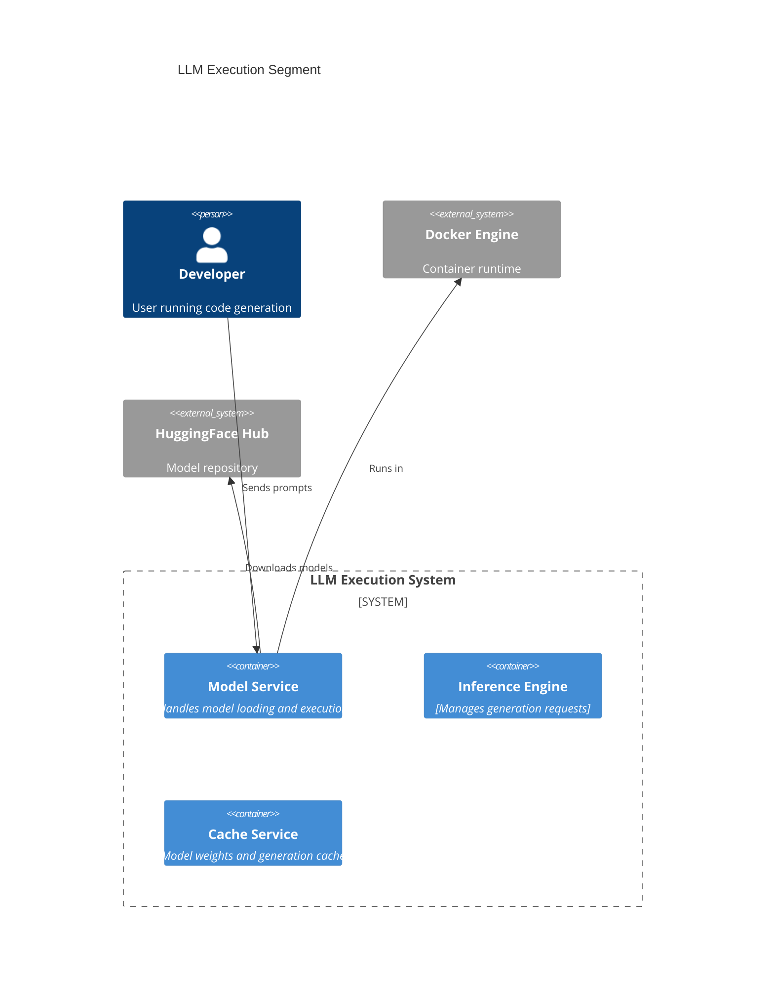
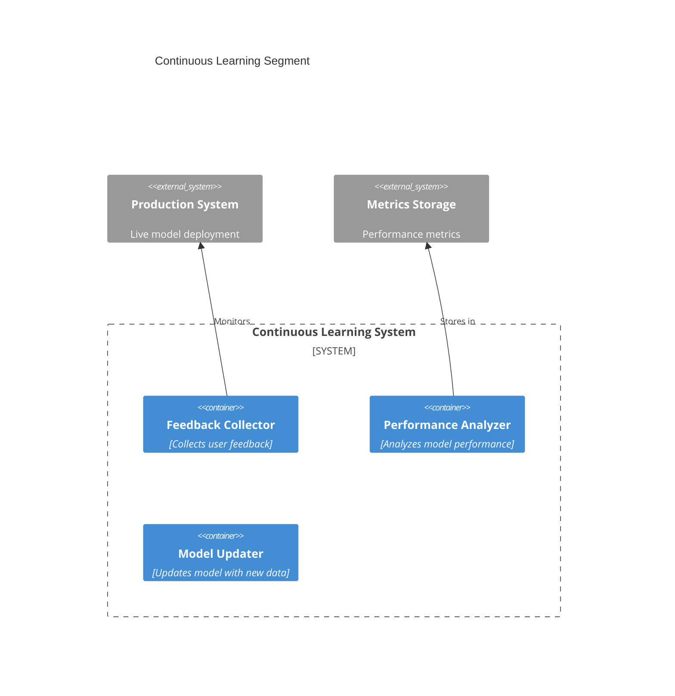

We are going to break down the project into distinct segments. Let's outline each segment following the C4 model approach:

## 1. LLM Execution
- Primary goal: Run and interact with various LLMs (DeepSeek, CodeLlama) efficiently
- Key components:

## 2. Data Collection
- Primary goal: Gather and process quality TypeScript training data
- Key components:

## 3. Fine-tuning
- Primary goal: Train models on collected TypeScript data
- Key components:

## 4. Continuous Learning
- Primary goal: Improve model over time with new data and feedback
- Key components:

## Integration Points:
1. Data Collection → Fine-tuning:
   - Dataset version control
   - Data quality metrics
   - Dataset splitting (train/validation/test)

2. Fine-tuning → LLM Execution:
   - Model deployment pipeline
   - Version management
   - Performance monitoring

3. LLM Execution → Continuous Learning:
   - Usage tracking
   - Error monitoring
   - Feedback collection

4. Continuous Learning → Data Collection:
   - Data quality improvements
   - Dataset augmentation
   - Sample selection optimization

Project Phases:
1. Phase 1: LLM Execution
   - Set up basic infrastructure
   - Implement model loading and inference
   - Create Docker environment

2. Phase 2: Data Collection
   - Implement dataset processing pipeline
   - Set up data validation
   - Create data storage system

3. Phase 3: Fine-tuning
   - Set up training infrastructure
   - Implement evaluation metrics
   - Create model checkpoint system

4. Phase 4: Continuous Learning
   - Implement feedback collection
   - Create performance monitoring
   - Set up model updating pipeline
