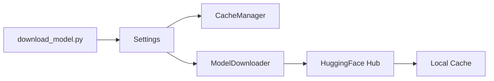

# HuggingFace Integration Design Map

## Design Documents

- `docs/impl/huggingface/integration.md`: Integration specifications
- `docs/architecture/design.download.md`: Download component design

## Implementation Components

### 1. HuggingFace Downloader

- **Source**: `downloader/hf.py`
- **Interface**:

```python
class ModelDownloader:
    """HuggingFace model download implementation."""
    def __init__(self, settings: Settings) -> None:
        self.settings = settings

    def download(self, model_id: str) -> bool:
        """Download model from HuggingFace Hub."""
```

### 2. Integration Points

- **Cache Management**:

  ```python
  # cache/manager.py -> CacheManager
  # Handles HuggingFace model storage structure
  model_dir = cache.get_model_path(model_id)
  ```

- **Configuration**:
  ```python
  # config/settings.py -> Settings
  # Manages HF token and environment
  token = os.getenv("HF_TOKEN")
  ```

## Flow Diagram



## Design Alignment

1. Download Component

   - Implements model retrieval from HF Hub
   - Follows design.download.md specifications
   - Uses snapshot_download for consistency

2. Cache Structure
   - Maintains HF model directory structure
   - Handles model file organization
   - Follows HF naming conventions
