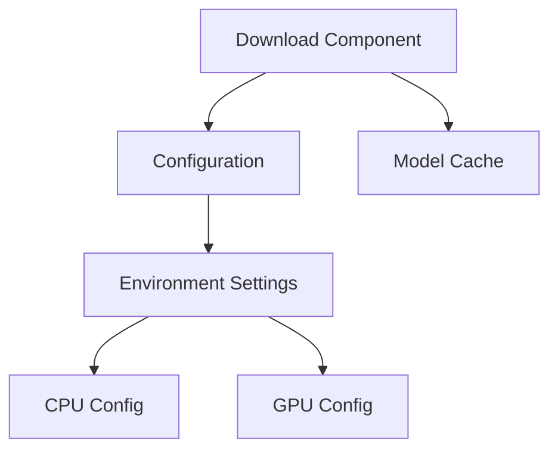

# LLM Service Implementation

## 1. Component Structure

### Download Component
```plaintext
scripts/
├── download_model.py     # Model download implementation
└── monitor_download.sh   # Download progress monitoring
```

### Configuration Component
```plaintext
config/
├── infra/               # Infrastructure configurations
│   ├── cpu.env         # CPU-specific settings
│   ├── gpu.env         # GPU-specific settings
│   └── default.env     # Default configurations
└── settings.py         # Configuration management
```

### Container Component
```plaintext
docker/
├── Dockerfile          # Main service container
└── docker-compose.yml  # Service orchestration
```

## 2. Component Interfaces

### Download Component Interface
```python
def download_model(model_id: str, cache_dir: Path) -> bool:
    """Download model from HuggingFace Hub
    
    Args:
        model_id: HuggingFace model identifier
        cache_dir: Local storage path for models
        
    Returns:
        bool: Success status of download
    """
```

### Configuration Component Interface
```python
class DownloadSettings(BaseSettings):
    MODEL_ID: str
    CACHE_DIR: Path
    HF_TOKEN: str | None
    IGNORE_PATTERNS: list[str]
```

## 3. Component Dependencies



## 4. Implementation Status

| Component    | Status | Test Coverage |
|--------------|--------|---------------|
| Download     | ✅     | 97%          |
| Config       | ✅     | N/A          |
| Monitoring   | ✅     | N/A          |
| Docker       | ✅     | N/A          |