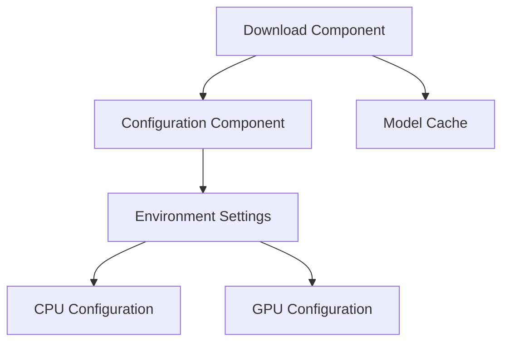

# LLM Service Implementation Documentation

## 1. File Structure Based on C4 Design

### System Context Level
```plaintext
services/ai/llm-service/
├── docs/               # System documentation
├── config/            # System configuration
├── docker/            # Containerization
└── scripts/           # Operational scripts
```

### Container Level
```plaintext
services/ai/llm-service/
├── src/
│   ├── api/          # API Gateway Component
│   ├── client/       # Client Integration Component
│   └── monitoring/   # Monitoring Component
├── scripts/          # Download Component
│   ├── download_model.py
│   └── monitor_download.sh
└── config/           # Configuration Component
    ├── infra/
    └── settings.py
```

### Component Level (Current Implementation)
```plaintext
services/ai/llm-service/
├── scripts/  # Download Component
│   ├── download_model.py        # Model Download Handler
│   ├── monitor_download.sh      # Download Progress Monitor
│   └── __init__.py             # Component Initialization
├── config/   # Configuration Component
│   ├── infra/
│   │   ├── cpu.env             # CPU Configuration
│   │   ├── gpu.env             # GPU Configuration
│   │   └── default.env         # Default Settings
│   └── settings.py             # Settings Management
└── tests/    # Test Suite
    └── test_download_model.py  # Download Component Tests
```

## 2. Source Code Map to C4 Design

### System Level Components

1. **Download Component** (Currently Implemented)
```plaintext
C4 Design Element           Source File
-------------------        ------------
Model Downloader          scripts/download_model.py
Progress Monitor         scripts/monitor_download.sh
Configuration           config/settings.py
Environment Config      config/infra/*.env
Tests                   tests/test_download_model.py
```

2. **Future Components** (To Be Implemented)
```plaintext
C4 Design Element           Source File
-------------------        ------------
API Gateway               src/api/gateway.py
Model Manager             src/api/model_manager.py
Inference Engine          src/api/inference.py
Client SDK                src/client/sdk.py
Metrics Collector         src/monitoring/metrics.py
Alert Manager            src/monitoring/alerts.py
```

### Component Relationships



Would you like me to:
1. Add more detail to any section?
2. Create sequence diagrams for component interactions?
3. Document specific component interfaces?