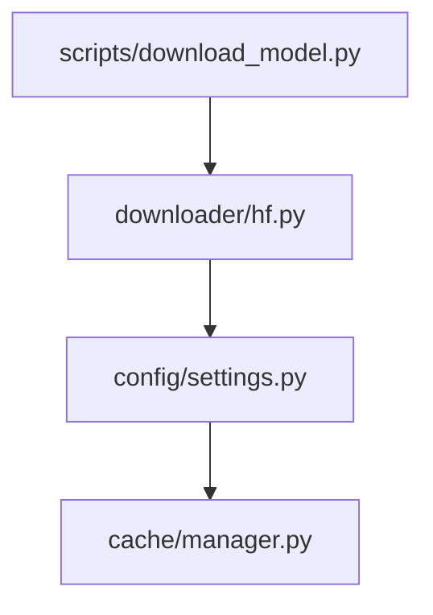

# Implementation Structure

```plaintext
services/ai/llm-service/
├── cache/             # Cache Management
│   └── manager.py     # Cache operations
├── config/            # Configuration Component
│   ├── infra/        # Environment configurations
│   │   ├── cpu.env
│   │   ├── default.env
│   │   └── gpu.env
│   └── settings.py    # Settings implementation
├── downloader/        # Download Component
│   └── hf.py         # HuggingFace integration
├── scripts/          # CLI Interface
│   └── download_model.py  # Download command
└── tests/            # Test Suite
    ├── test_settings.py     # Settings component tests
    └── test_download.py     # Download component tests
```

## Component Dependencies



## Design References

- Configuration Component: [design.c4.md#config-component](../architecture/design.c4.md#config-component)
- Download Component: [design.download.md](../architecture/design.download.md)
- HuggingFace Integration: [integration.md](huggingface/integration.md)
