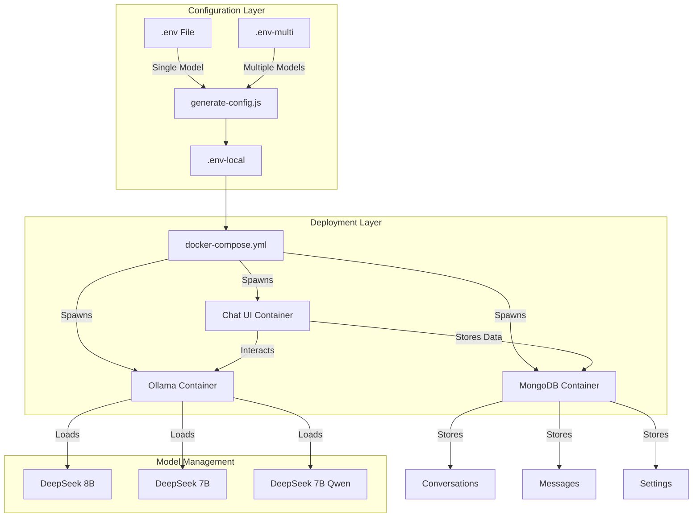
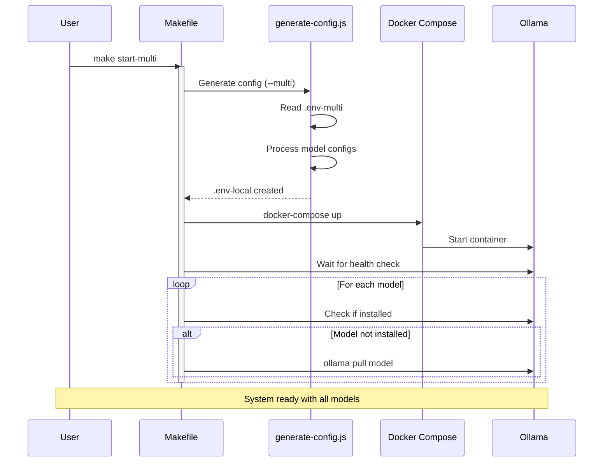

# Qi Chat Service

A containerized chat service using Ollama, MongoDB, and HuggingFace's Chat UI.

## Architecture

- **MongoDB**: Database server
- **Ollama**: LLM service running Deepseek model(s)
- **Chat UI**: HuggingFace's web interface

## Prerequisites

- Docker Engine 24.0+
- Docker Compose v2.0+
- Make
- Node.js v18+ (for configuration generation)
- 8GB+ RAM (for the Ollama service)
- NVIDIA GPU (optional)

## Setup

1. **Clone the repository:**

   ```bash
   git clone <repository-url>
   cd <repository-name>
   ```

2. **Install dependencies:**

   ```bash
   npm install
   ```

3. **Configure your environment:**

   - **Common Configuration (.env):**  
     Edit `.env` for global settings such as MongoDB, Ollama port, UI port, HuggingFace token, and model parameters.

     Example `.env`:
     ```ini
     # MongoDB Configuration
     MONGO_ROOT_USER=admin
     MONGO_ROOT_PASSWORD=your_secure_password
     MONGO_PORT=27017

     # Ollama Configuration
     CONTAINER_CPU_LIMIT=12
     CONTAINER_MEMORY_LIMIT=32G
     OLLAMA_PORT=11434

     # Model Configuration
     MODEL_NAME=deepseek-r1
     MODEL_SIZE=8b
     MODEL_VARIANT=llama-distill-q4_K_M

     # Performance Settings
     OLLAMA_NUM_THREAD=12
     OLLAMA_NUM_CTX=2048
     OLLAMA_NUM_BATCH=512
     OLLAMA_GPU=0

     # Chat UI Configuration
     UI_PORT=3000
     HF_TOKEN=your_huggingface_token
     ```

   - **Multi‑Model Configuration (.env-multi, optional):**  
     For multi‑model mode, create/edit `.env-multi` with your model configurations.

     Example `.env-multi`:
     ```json
     {
       "MODELS": [
         {
           "name": "deepseek-r1:8b-llama-distill-q4_K_M",
           "parameters": {
             "num_thread": 12,
             "num_ctx": 2048,
             "num_batch": 512
           },
           "endpoints": [
             {
               "type": "ollama",
               "url": "http://ollama-service:11434",
               "ollamaName": "deepseek-r1:8b-llama-distill-q4_K_M"
             }
           ]
         }
       ]
     }
     ```

---

## Usage



---



---

### Available Commands

```bash
# View all available commands
make help

# Start services:
make start-single     # Single model mode (default)
make start-multi      # Multi-model mode

# Stop and clean:
make stop            # Stop all containers
make clean           # Stop and remove volumes

# Model management:
make list-models     # List installed models
make model-info      # Show model details
make pull-model      # Pull a new model

# Monitoring:
make logs           # View container logs
```

### Quick Start

1. **Start in single-model mode:**
   ```bash
   make start-single
   ```
   Or for multi-model mode:
   ```bash
   make start-multi
   ```

2. **Access services:**
   - Chat UI: http://localhost:3000
   - Ollama API: http://localhost:11434
   - MongoDB: localhost:27017

## Troubleshooting

If you encounter issues:

1. **Check logs:**
   ```bash
   make logs
   ```

2. **Restart services:**
   ```bash
   make stop
   make clean
   make start-single  # or make start-multi
   ```

3. **Verify model installation:**
   ```bash
   make list-models
   ```

## Contributing

1. Fork the repository
2. Create a feature branch
3. Commit your changes
4. Push to your branch
5. Create a Pull Request

## License

MIT License