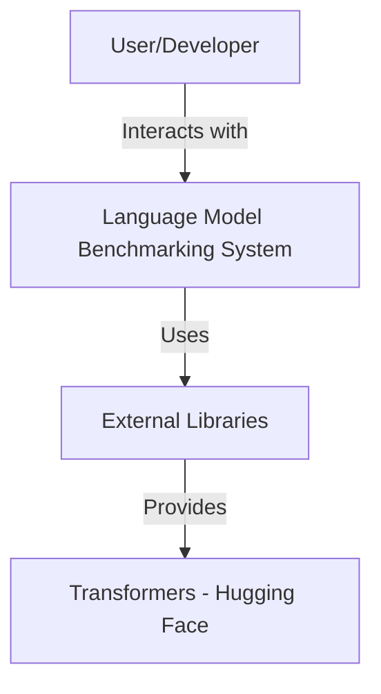
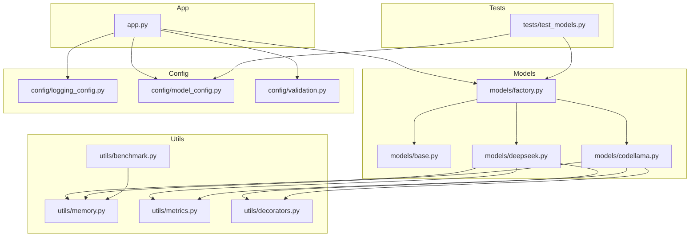
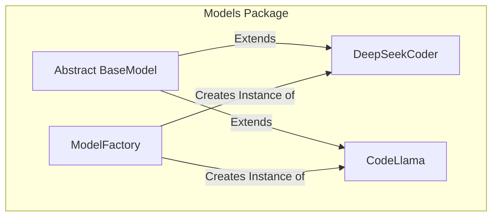

Below is a formal project specification along with a set of C4 model diagrams that illustrate the project's architecture.

----

## 1. Formal Specification

### 1.1. Introduction

The project is a Python-based system for automated generation and benchmarking of language model outputs. Its primary objectives are:
- To provide an extensible framework for interacting with different language models.
- To benchmark model performance in terms of response time and memory usage.
- To enforce configuration and input validations.

### 1.2. Scope

The system includes:
- **Model Abstractions:** An abstract base class defines a standard interface for modeling tasks.
- **Concrete Model Implementations:** Specific implementations (e.g., DeepSeek and CodeLlama) extend the base model.
- **Factory Pattern:** A factory class responsible for instantiating and managing model types.
- **Utilities:** Modules to monitor performance (timing and memory consumption) through decorators and metrics.
- **Configuration Management:** Centralized setup for logging and model configurations with validations.
- **Testing:** Automated unit tests to ensure correctness of model instantiation, configuration validation, and input processing.

### 1.3. Architecture Overview

- **Models:**  
  - Abstract class (`BaseModel`) in base.py defines the contract for models.
  - Concrete implementations (`DeepSeekCoder` in deepseek.py and `CodeLlama` in codellama.py) provide specific functionality.
  - Factory (`ModelFactory` in factory.py) dynamically creates instances of the correct model type.
  
- **Configuration:**  
  - Logging configuration (`config/logging_config.py`) sets up global logging behavior.
  - Model configurations (`config/model_config.py`) and validations (`config/validation.py`) ensure models are set up correctly.
  
- **Utilities:**  
  - Performance and memory utilities (`utils/metrics.py`, memory.py, and decorators.py) track execution time and resource usage.
  - A benchmarking module (`utils/benchmark.py`) aggregates performance data during model execution.
  
- **Application Layer:**  
  - The main application (`app.py`) loads models and interfaces with external libraries (like Hugging Face's Transformers) to perform actions such as text generation.
  
- **Testing:**  
  - Tests (`tests/test_models.py`) verify that configurations are valid, models process inputs correctly, and the factory instantiates the correct model types.

### 1.4. Interfaces and Collaborations

- **Model Interface:**  
  All models expose a similar interface:
  - `load_model()`: Loads the model and tokenizer.
  - `generate(prompt: str, **kwargs)`: Generates a response from a model for a given prompt.
  - `validate_input(prompt: str) -> bool`: Validates the input prompt.
  - `preprocess_prompt(prompt: str) -> str`: Preprocesses the prompt if necessary.

- **Factory Interaction:**  
  `ModelFactory.get_model(model_type: str)` returns a model class based on the given identifier. This decouples client code from concrete implementations.

- **Utility Decorators:**  
  The `track_resources` decorator (from decorators.py) wraps model generation methods to log performance metrics and memory usage before and after execution.

- **Configuration and Logging:**  
  The centralized logging configuration ensures consistent logging across all modules, while the model configuration and validation mechanisms ensure that improper configurations are caught early.

----

## 2. C4 Model Diagrams

### 2.1. Level 1: System Context Diagram

**Description:**  
- The **User/Developer** interacts with the system via command-line or IDE.
- The **Language Model Benchmarking System** encapsulates all internal modules.
- The system relies on external libraries (like Transformers) to load and interact with models.

### 2.2. Level 2: Container Diagram

**Description:**  
- **App:** The entry point (`app.py`) that coordinates model operations.
- **Models:** Contains the base and concrete model implementations along with the factory.
- **Config:** Manages configuration settings for logging and models.
- **Utils:** Provides helper functions for metrics, memory tracking, and decorators.
- **Tests:** Contains unit tests to validate system behavior.

### 2.3. Level 3: Component Diagram – Models Package

**Description:**  
- **BaseModel** defines the standard interface.
- **DeepSeekCoder** and **CodeLlama** are concrete implementations of the BaseModel.
- The **ModelFactory** provides a mechanism to create instances of these models, enforcing the abstraction.

----

## 3. Usage Note

- **Extensibility:**  
  The system is built to allow additional models to be integrated seamlessly. New models need to inherit from `BaseModel` and should be registered with the `ModelFactory`.

- **Resource Tracking:**  
  The use of decorators and utilities for measuring performance and memory usage is critical for benchmarking, ensuring that model deployments can be optimized.

- **Configuration Consistency:**  
  Centralized logging and configuration validation helps maintain consistency and prevent configuration errors in production.

----

This specification and the accompanying C4 diagrams should provide a clear high-level understanding of your project's architecture, components, and their interactions.