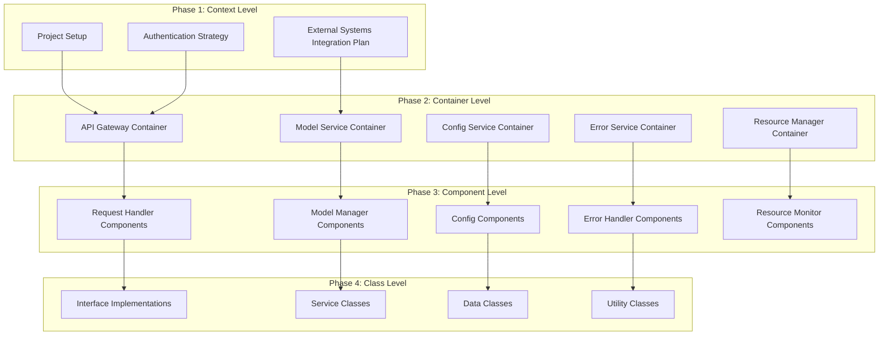

1. File Structure Based on C4 Design:

```
llm_service/
├── api/                     # API Plane
│   ├── __init__.py
│   ├── gateway/            # API Gateway Container
│   │   ├── handlers/       # Request Handlers
│   │   ├── middleware/     # Auth, Rate Limiting
│   │   └── routes/         # API Routes
│   └── admin/             # Admin API Container
│       ├── handlers/
│       └── routes/
│
├── core/                   # Data Plane
│   ├── __init__.py
│   ├── models/            # Model Service Container
│   │   ├── manager/       # Model Management
│   │   ├── inference/     # Inference Engine
│   │   └── optimization/  # Model Optimization
│   ├── cache/            # Cache Service Container
│   │   ├── manager/
│   │   └── storage/
│   └── resources/        # Resource Manager Container
│       ├── memory/
│       ├── cpu/
│       └── gpu/
│
├── control/               # Control Plane
│   ├── __init__.py
│   ├── config/           # Config Service Container
│   │   ├── loader/
│   │   ├── validator/
│   │   └── environment/
│   ├── errors/          # Error Service Container
│   │   ├── handler/
│   │   ├── recovery/
│   │   └── logging/
│   └── monitoring/      # Health Monitor Container
│       ├── metrics/
│       ├── health/
│       └── alerts/
│
├── common/               # Shared Components
│   ├── __init__.py
│   ├── interfaces/      # Abstract Base Classes
│   ├── types/          # Custom Types & Enums
│   └── utils/          # Utility Functions
│
├── tests/               # Tests matching structure above
│   ├── api/
│   ├── core/
│   ├── control/
│   └── integration/
│
├── deployment/          # Deployment Configuration
│   ├── docker/
│   ├── kubernetes/
│   └── configs/
│
└── docs/               # Documentation
    ├── api/
    ├── architecture/
    └── deployment/
```

2. Implementation Plan Mapped to C4 Layers:



---

Implementation Phases Mapped to C4:

1. **Context Level Implementation (Week 1)**
   - System Boundaries
     * Define external system interfaces (HuggingFace, Monitoring)
     * Set up authentication service integration
     * Establish logging infrastructure
   
   - Key Files:
     ```
     - api/gateway/middleware/auth.py
     - core/models/external/huggingface.py
     - control/monitoring/external/prometheus.py
     ```

2. **Container Level Implementation (Weeks 2-3)**
   - API Container
     * Gateway setup
     * Admin API setup
     * Route definitions
   
   - Core Containers
     * Model service foundation
     * Cache service setup
     * Resource manager implementation
   
   - Control Containers
     * Configuration service
     * Error handling service
     * Monitoring service
   
   - Key Files:
     ```
     - api/gateway/
     - core/models/
     - core/cache/
     - control/config/
     - control/errors/
     ```

3. **Component Level Implementation (Weeks 4-5)**
   - API Components
     * Request handlers
     * Response formatters
     * Middleware components
   
   - Core Components
     * Model managers
     * Inference engines
     * Cache managers
     * Resource monitors
   
   - Control Components
     * Configuration loaders
     * Error handlers
     * Health checkers
   
   - Key Files:
     ```
     - api/gateway/handlers/
     - core/models/manager/
     - core/models/inference/
     - control/config/loader/
     - control/errors/handler/
     ```

4. **Class Level Implementation (Week 6)**
   - Base Classes
     * Abstract interfaces
     * Base implementations
     * Utility classes
   
   - Service Classes
     * Concrete implementations
     * Service integrations
     * Helper classes
   
   - Key Files:
     ```
     - common/interfaces/
     - common/types/
     - api/gateway/services/
     - core/models/services/
     ```

5. **Integration and Testing (Week 7)**
   - Integration Tests
     * Container integration
     * Component integration
     * End-to-end testing
   
   - Key Files:
     ```
     - tests/integration/
     - tests/api/
     - tests/core/
     - tests/control/
     ```

6. **Deployment Setup (Week 8)**
   - Deployment Configuration
     * Docker setup
     * Environment configurations
     * Service orchestration
   
   - Key Files:
     ```
     - deployment/docker/
     - deployment/kubernetes/
     - deployment/configs/
     ```
