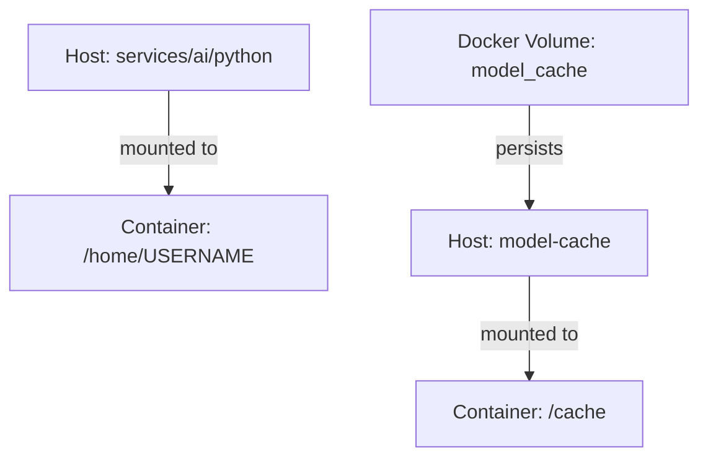

# Technical Note: Project Structure and Container Setup

## Directory Structure

```plaintext
qi-v2-dp/
├── .devcontainer/
│   ├── docker-compose.yml    # Container orchestration
│   └── python/
│       └── Dockerfile        # Python dev environment
└── services/
    └── ai/
        └── python/           # LLM Service
            ├── app.py
            ├── model-cache/  # Local cache directory
            └── models/       # Model implementations
```

## Container Setup

### Volume Mapping
```yaml
services:
  coder:
    volumes:
      - ../services/ai/python:/home/${USERNAME:-user}:cached   # Project root
      - ../services/ai/python/model-cache:/cache:cached        # Model cache
```

### Data Flow


## Key Points

1. **Project Root**
   - Host: python
   - Container: `/home/${USERNAME}`
   - Contains all Python service code
   - Working directory for development

2. **Model Cache**
   - Host: `services/ai/python/model-cache/`
   - Container: `/cache`
   - Backed by Docker volume `model_cache`
   - Structure:
     ```plaintext
     model-cache/
     ├── transformers/    # Model weights
     └── huggingface/    # HF cache
     ```

3. **Environment Configuration**
   ```python
   # filepath: services/ai/python/app.py
   def setup_environment():
       """Initialize cache directories"""
       cache_dirs = [
           "model-cache/transformers",
           "model-cache/huggingface"
       ]
       for dir_path in cache_dirs:
           os.makedirs(dir_path, exist_ok=True)
   ```

4. **Container Environment**
   ```bash
   TRANSFORMERS_CACHE=/cache/transformers
   HF_HOME=/cache/huggingface
   ```

## Usage Flow

1. Project initialization:
   ```bash
   # Create Docker volume
   docker volume create model_cache
   
   # Start development container
   docker compose up -d coder
   ```

2. First run:
   ```bash
   # Inside container
   cd /home/${USERNAME}
   python app.py  # Creates cache directories if needed
   ```

3. Model downloads:
   - Models downloaded to `/cache/transformers`
   - Persisted in Docker volume
   - Available between container restarts

## Benefits

- Clear separation of development and cache
- Persistent model storage
- Consistent paths in code
- Development environment isolation
- Easy to clean/rebuild without losing models